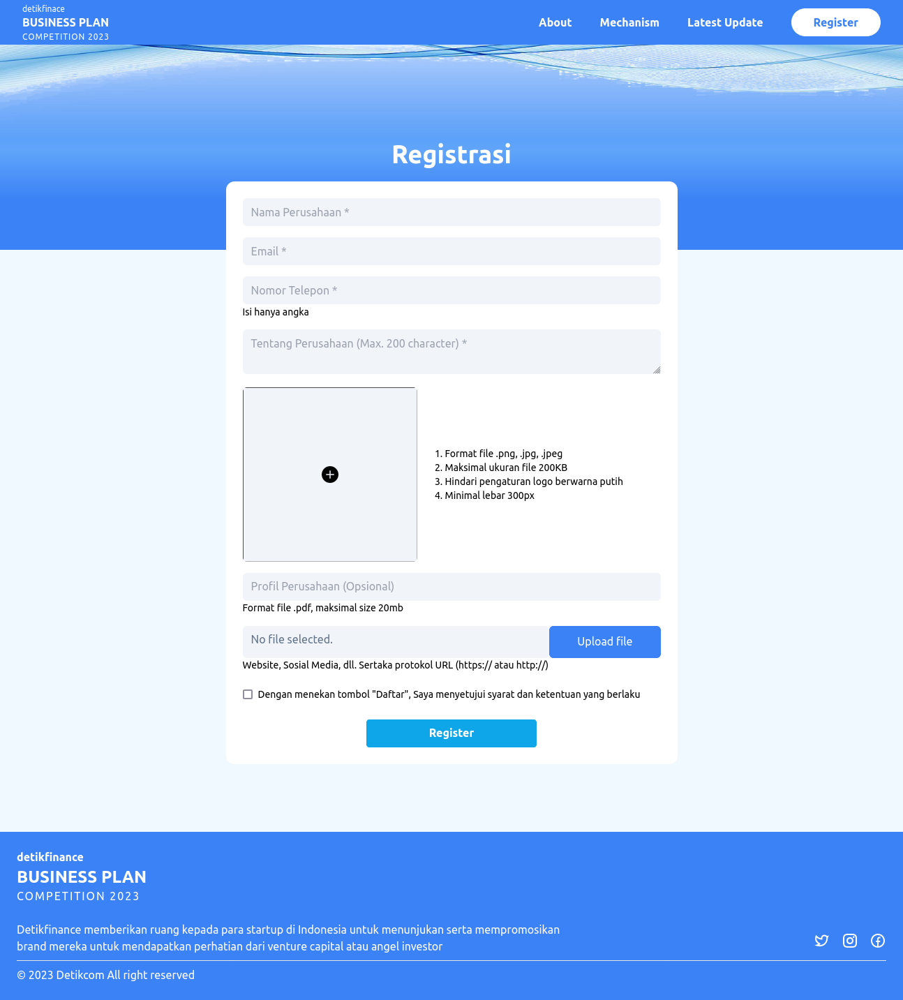

# Getting Started

### Clone this repository

```bash
https://github.com/yusronab/detik-test.git
```

### Run project in the project directory

```bash
npm start
```

# Tech Stack

- [x] React.js
- [x] Tailwind CSS
- [x] React Swiper

# Live Demo

Click [this link](https://github.com/yusronab) to try live demo.

# Preview

| User Interface    | Desc |
| -------- | ------- |
|   | Home Page |
|   | Register Page |

